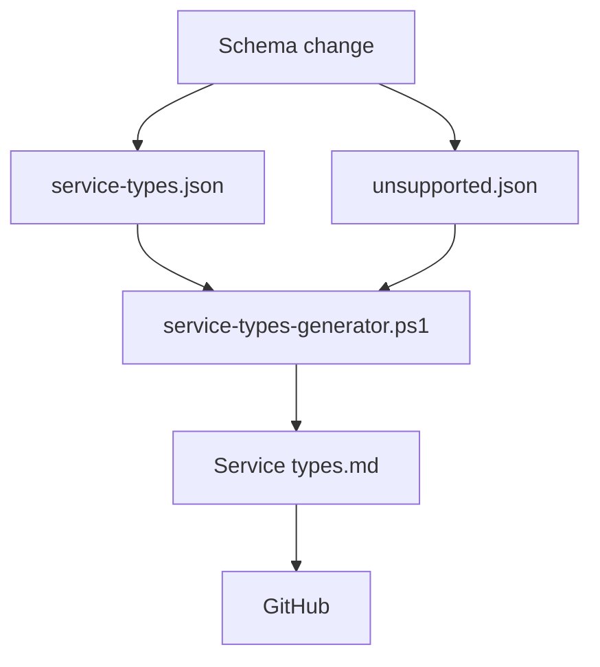

# Service Types Table Generator (Demo)

> This demo is part of my portfolio. Check my post at: https://doxmachina.eu/blog/docs-automation

This repository showcases a lightweight automated documentation workflow designed to keep Markdown content synchronized with an external single source of truth.

## How It Works

A PowerShell script (`/scripts/generate-service-table.ps1`) performs the following steps:

- reads data from two JSON schemas (`/schema/service-types.json` and `/schema/unsupported.json`)
- generates a service types table (exluding unsupported combinations)
- injects the generated content into `/docs/service types.md` between the placeholder markers:
    
    `<!-- DYNAMIC CONTENT - DO NOT EDIT: START -->`  
    `<!-- DYNAMIC CONTENT - DO NOT EDIT: END -->`

## Diagram

## Automated Updates (CI/CD)

A GitHub Actions workflow monitors changes to the JSON schemas.

Whenever either schema changes:

- the generator script runs automatically

- the workflow commits the updated Markdown file to a dedicated branch and initiates a pull request

## Use Case

- **Developers** maintain `service-types.json`
- **Product Management** maintain `unsupported.json`
- **Technical Writers** maintain `service-types.md`

The automation layer keeps all three sources aligned, eliminating manual updates, human error and out‑of‑sync documentation when Product‑driven changes affect Developer‑maintained mappings.

## Notes

This repository is **spec work** and it's not maintained.  
Please do not submit pull requests and issues.

You are welcome to fork this repository and experiment on your own.